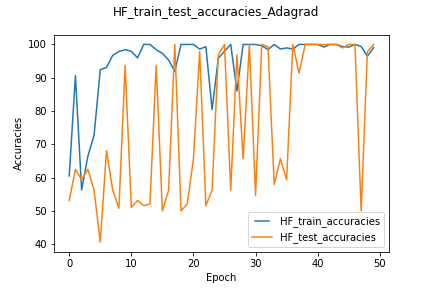

# HPML-Final-Proj
This project trains three Deep Learning models with four data augmentation methods and three optimizers. For each model, we will determine the best pair of augmentation and optimizer, and finally we will find the model with best performance based on the results we obtained.

## Run AlexNet code in HPC
Files for Alexnet are all stored in the folder named "Alexnet". Four python files are written for each augmentations. Below are arguments that can be passed to the files:
* --optimizer: specify which optimizer (SGD, Adagrad, Adam) to use for training. Default: sgd
* --num_gpu: specify the number of GPUs to run

Here are the examples to run four Alexnet python files: 
`python augmentation1.py --optimizer SGD --num_gpu 2` 
`python augmentation2.py --optimizer Adagrad --num_gpu 2` 
`python augmentation3.py --optimizer Adam --num_gpu 2` 
`python augmentation4.py --optimizer SGD --num_gpu 2` 

These mean that run Alexnet model with augmentation 1 (horizontal flip) and SGD; run Alexnet with augmentation 2 (Center Crop & Grayscale) and Adagrad; run Alexnet with augmentation 3 (Color Jitter & Pad) with Adam; and run Alexnet with augmentation 4 (Random rotation and Random Vertical Flip). These jobs are all done with batch size 32, 50 epochs, and 2 GPUs in NYU Greene. After finishing training and testing, two plots containing training/testing accuracy and training/testing losses will be returned and saved to the folder 2GPU_plots. For example, aug1_Adagrad_accuracy.png means the accuracy plot of Alexnet running with augmentation 1 and Adagrad.

## Run GoogleNet and VGG code in HPC
File run-googlenet-VGG.py is the gateway to trian and test with GoogleNet and VGG16. Below are arguments that can be passed to the file:
* --optimier: specify which optimizer, sgd, adagrad, or adam, to use. Default: sgd
* --cuda: If passed, the job will be trained with GPU. 
* --aug: specify which augmentation method to use. Available options: HorizontalFlip, CenterCrop, ColorJitter, and VerticalFlip. Default: HorizontalFlip
* --batchSize: specify the batch size to load training data. Default: 32
* --numGPUs: specify the number of GPUs to use to train and test the job. Default: 1
* --model: specify the deep learning model to use. Available options: googlenet and vgg. Default: googlenet.

Here is and example of running run-googlenet-VGG.py:  
`python3 run-googlenet-VGG.py --cuda --aug=ColorJitter --model=vgg --numGPUs=2 --batchSize=32 --optimizer=sgd` 
It means using VGG16 network with Color Jitter augmentation and SGD optimizer to train and test. The job will be run with training batch size 32 and on 2 GPUs. After training and testing, it will plot the training and testing accuracies/losses and save them in two pngs. For example, HorizontalFlip__train_test_accuracies_sgd_2_vgg.png means the accuracy plot using VGG16 network with Horizontal Flip and SGD on 2 GPUs.

## GoogLeNet Results
### Results – GoogLeNet with SGD
HorizontalFlip train/test accuracy and loss: 

    
CenterCrop & Grayscale train/test accuracy and loss: 

ColorJitter & Pad train/test accuracy and loss: 

    
Random rotation & VerticalFlip train/test accuracy and loss: 

    
Augmentation CenterCrop & Grayscale has the best performance of GoogLeNet with SGD.

### Results – GoogLeNet with Adagrad
HorizontalFlip train/test accuracy and loss: 

   
CenterCrop & Grayscale train/test accuracy and loss: 

   
ColorJitter & Pad train/test accuracy and loss: 

   
Random rotation & VerticalFlip train/test accuracy and loss: 

   
Augmentation HorizontalFlip has the best performance of GoogLeNet with Adagrad.

### Results – GoogLeNet with Adam
HorizontalFlip train/test accuracy and loss: 

   
CenterCrop & Grayscale train/test accuracy and loss: 

   
ColorJitter & Pad train/test accuracy and loss: 

   
Random rotation & VerticalFlip train/test accuracy and loss: 

   
Augmentation CenterCrop & Grayscale has the best performance of GoogLeNet with Adam.

## VGG16 Results
### Results – VGG with SGD
HorizontalFlip train/test accuracy and loss: 

CenterCrop & Grayscale train/test accuracy and loss: 

ColorJitter & Pad train/test accuracy and loss: 

   
Random rotation & VerticalFlip train/test accuracy and loss: 

Augmentation CenterCrop has the best performance of VGG with SGD.

### Results – VGG with Adagrad
HorizontalFlip train/test accuracy and loss: 

CenterCrop & Grayscale train/test accuracy and loss: 

ColorJitter & Pad train/test accuracy and loss: 

   
Random rotation & VerticalFlip train/test accuracy and loss: 

Augmentation CenterCrop has the best performance of VGG with Adagrad.

### Results – VGG with Adam
HorizontalFlip train/test accuracy and loss: 

CenterCrop & Grayscale train/test accuracy and loss: 

ColorJitter & Pad train/test accuracy and loss: 

   
Random rotation & VerticalFlip train/test accuracy and loss: 

Augmentation VerticalFlip has the best performance of VGG with Adam.

### Results – Alexnet with SGD
HorizontalFlip train/test accuracy and loss: 

CenterCrop & Grayscale train/test accuracy and loss: 

ColorJitter & Pad train/test accuracy and loss: 

Random rotation & VerticalFlip train/test accuracy and loss: 

Augmentation Center Crop has the best performance of Alexnet with SGD.

### Results – Alexnet with Adagrad
HorizontalFlip train/test accuracy and loss: 

CenterCrop & Grayscale train/test accuracy and loss: 

ColorJitter & Pad train/test accuracy and loss: 

Random rotation & VerticalFlip train/test accuracy and loss: 

Augmentation Color Jitter has the best performance of Alexnet with Adagrad.

### Results – Alexnet with Adam
HorizontalFlip train/test accuracy and loss: 

CenterCrop & Grayscale train/test accuracy and loss: 

ColorJitter & Pad train/test accuracy and loss: 

Random rotation & VerticalFlip train/test accuracy and loss: 

Augmentation Color Jitter has the best performance of Alexnet with Adam. 

## Final Conclusion:
Best Model – Alexnet 
Best Augmentation – Color Jitter & Pads 
Best Optimizer – Adagrad 
